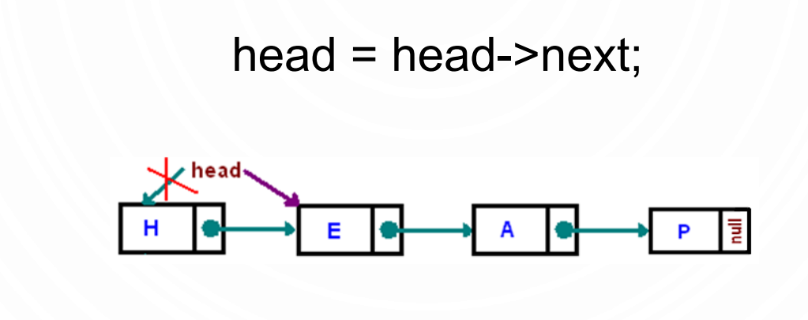
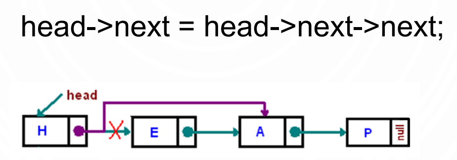
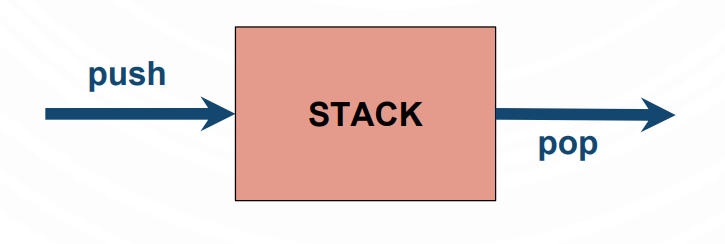
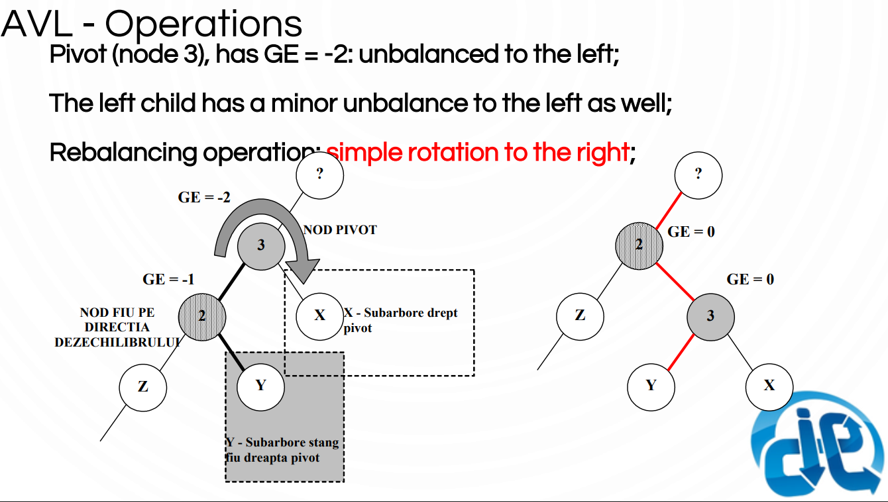

# Teorie pentru examen

## Declarations and types
**Type specifiers:**
* void 
* char 
* short 
* int 
* long 
* float 
* double 
* signed/unsigned
* struct/union 
* enum

**Type qualifiers:**
* const
* volatile

**Storage-class specifier:**
* auto 
* register 
* static 
* extern 
* typedef
* __declspec

**User defined types**
* Article
    * Groups different types of primitive variables 
    * Aggregated type which uses compact memory

* Bit structure
    * A particular type of article which allows users access at bit level

* Union
    * Allows that the same memory region be defined as two or multiple different types of variables

* Enumeration
    * Is a list of constant integer variables with given names

Synonyms 
    * Are defined by using the typedef specifier
#
**Bitwise operators:**
* & - AND
* | - OR
* ^ - OR exclusive - XOR
* ~ - One complement (flips bit value)
* .>> - Right shifting
* << - Left shifting

#

## Simple linked lists
* Linear structures, heap allocated, managed by a pointer to the first element of the lsit called head.
* Main operations:
    * Insertion
    * Deletion
    * Parsing
* Resembles the unidimensional arrays
* Contains two types of fields:
    * pointer to the next element (link data)
    * a field for the useful data
* if we write head = head->next we change the head of the list
* if we write head->next = head->next->next we change where the LINK from the head points to

#

## Stacks
* Definition:
    * It is a linear structure in which the two basic operations, insertion and deletion are made on a LIFO (Last In First Out) rule. These operations are made in a single part of the structure called the head of the stack, or the top.

* Operations
    * PUSH -> adding an element
    * POP -> deleting an element
    * PEEK -> looking at the top element

#

## Infix - Postfix - Prefix notations
* **Notations:**
    * **Polish notation** - prefix notation
    * **Reverse Polish notation** - postfix notation

* **Characteristics:**
    * **Polish notation** (prefix): the operators are written `before` the operands.
    * **Reverse Polish notation** (postfix) - the operators are placed `after` the operands.
* **Hierarchy**

#
**Dijkstra-Shunting yard algorithm**
* **1st step:** Scan the entire infix expression from left to right and look for `tokens` (operators, operands and paranthesis)
* **2nd step:** For each token test:
    * if token is an `operator`
        * Remove all operators at the top of the stack that have
          higher or equal precedence compared to the incoming
          operator, and add them to the postfix expression following
          this step, place the new operator onto the stack
    * if token is an `operand`
        * append it to the postfix expression
    * if token is a `left paranthesis`
        * push it on the stack
    * if token is a `right paranthesis`
        * Remove all operators from the stack and add them to the postfix
          expression until a matching left parenthesis is encountered. Do not add this left parenthesis to the result, simply discard it.

`Example:`
* Infix->Postfix: 2*(4+3)+9/3
* We iterate through each token and use the table and theory from above
    * First iteration:
        * Output: 2
        * Stack: nothing
    * Second iteration:
        * Output: 2
        * Stack: *
    * Third iteration:
        * Output: 2
        * Stack: *(
    * Fourth iteration:
        * Output: 24
        * Stack: *(
    * Sixth iteration:
        * Output: 24
        * Stack: *(+
    * Seventh iteration:
        * Output: 243
        * Stack: *(+
    * Eigth iteration:
        * Output: 243+
        * Stack: *
    * Ninth iteration:
        * Output: 243+*
        * Stack: +
    * Tenth iteration:
        * Output: 243+*9 
        * Stack: +
    * Eleventh iteration:
        * Output: 243+*9
        * Stack: +/
    * Twelfth iteration:
        * Output: 243+*93
        * Stack: +/
    * Last iteration (congrats if you made it!!!)
        * Output: 243+*93/+
        * Stack: nothing
#
**Postfix evaluation algorithm**
* **1st step:** Scan the entire postfix expression from left to right and look for `tokens` (operators, operands and paranthesis)
* For each `token` test wheter:
    * If token is an `operand` is pushed on the stack
    * If token is an `operator`:
        * Pop the `left element` from the stack into a `y` variable;
        * Pop the `right element` from the stack into a `x` variable;
        * The operation between `x` operator `y` is computed;
        * The result is `pushed` on the stack;
* The last value standing on the stack is the result of the expression

#

## Queues
* **Definition:**
    * It is a linear structure in which the two basic operations, insertion and deletion are made on a `FIFO`(First In First Out) based model. The `insertion` is made on the `tail section` and the `deletion` is made on the `front section` of the queue.
#

## Hash Tables
* **Definition:**
    * A hash table is a data structure which puts togheter two sets, binding them uniquely by using a hash function.
* **Composition of a hash table:**
    * `unique keys` - indices
    * `values` - data stored at an index location
* **Process:**
    * keys -> hash_function() -> values
* **Speed-Space correlation:**
    * if space goes up, speed goes down and vice-versa
* **Advantages:**
    * `Searching` in O(1) Time: Direct address tables use arrays which are random access data structures, so, the key values (which are also the index of the array) can be easily used to search the records in O(1) time.
    * `Insertion` in O(1) Time: We can easily insert an element in an array in O(1) time. The same thing applies for a direct address table.
    * `Deletion` in O(1) Time: Deletion of an element takes O(1) time in an array. Similarly, to delete an element in a direct address table we need O(1) time.
* **Limitations:**
    * We need to know the maximum value from the key set, thus, it is only useful if the maximum value is very small.
    * Uses too much memory if there is a significant difference between total number of records and the maximum value. 
    * Few elements with very high values for keys;
* **Characteristics:**
    * The total number of keys must be previously known in order
      to correctly size a one-dimensional array
    * If the array is undersized then many elements will be crowded into a small area, leading to the creation of clusters
    * If the array is too big, then memory will be wasted
    * Minimizes data search operations by using direct access
    * Is a data structure used for storing and fast searches
    * The index or the key at which an element can be found is given by the hash function
    * An efficient way of managing memory
    * Hash functions have different complexity levels influencing
how items are spread across the entire structure
    * hash(k) = k % m
* **Advantages:**
    * Using alphanumeric keys for the search operation
    * The hash function makes the connection between the alphanumeric key and the index of the element
    * Uses the index computed by the hash function to directly access the elements of the structure
* **Disadvantages:**
    * Need extra processing for computing the hash function
    * The concept of collision which states that two different
    values can have the same hashed key: Xh, Yh where Xh != Yh, have identical hash keys hash(Xh) = hash(Yh)
    * Collision avoidance needs extra processing such as:
    chaining, re-hashing, linear probing, quadratic probing or overflow area.
* **More characteristics:**
    * The hash key must be a `deterministic` function
    * It should evenly distribute keys across buckets
    * The size of the key set is smaller compared with the size of the elements that need to be mapped
* **Key classification:**
    * `Numeric keys:` easy to process
    * `Alphanumeric keys:` array of characters or strings
    * `Compound keys:` based on multiple fields
* **Hash function**
    * `Goal:` to spread as uniformly and as random as possible the elements into a hash table.
    * `Processes` the key of each record
    * `Identifies` data inside the hash table
    * `There’s no generic hash function`
    * Choosing hash function is made based on the `characteristics of the
value set`
* **Avoiding collisions:**
    * Methods of managing elements in a hash table in which two different values generates `two identical hashes`:
        * `Separate chaining:` using an array of linear lists
            * Uses an array of buckets
            * Each slot has its own linked list of collisions
            * All the elements from a list have the same hash values
            * Searching an element mean to identify the correct bucket
            based on the hash value after which the list needs to be crossed
        * `Open addressing:`
            * `Linear probing:`
                * Sequential searches of the first free bucket in which the new element can be inserted, to the left or right of the position pointed by the hash value (collision place);
                * Search in a hash table implemented with linear probing: all adjacent elements to the position referred by the hash value must be checked
                * `Disadvantage:` if the number of collisions is high than clusters can develop, the probability of having collisions not only for same values of hash but also for adjacent values
            * `Quadratic probing:`
                * Probing for free slots inside the hash table by using a step; In linear probing the step is +/- 1
                * Reduces the probability of having collisions for the adjacent hash values and spreads the elements uniformly in the structure
                * Reduces the risk of clusters for repeated collisions
            * `Overflow area:`
                * Splits the hash table in two regions:
                * `Primary area` used for storing the initial elements;
                * `Secondary area` used for storing the collisions
                * When searching for an element a pointer is used for referring to the collision area locations
                * The `access` to the secondary area is made by using a pointer stored in the primary area
                * The search time operation is almost constant O(1), much better than other types of implementations
            * `Cascade Hashing:`
                * Applying multiple hashing functions until the value obtained is a free position from the hash table
                * Each step of the searching process computes a new hash value of the key until an empty position is found or until there is no possibility for computing another hash.

#

## Heaps

### **Heap**
* **Definition:**
    * A heap is a specialized tree-based data structure that satisfies the
property: if `A` is `parent` for `B` than between the values of A and B a semantic relation of total order is applied

### **Binary-heap**
* **Definition:**
    * A binary-heap structure is a complete binary tree which can be linearized.
    * If node `A` is `parent` of node `B`, then:
        * if value(A) >= value(B) => max Heap
        * if value(A) <= value(B) => min Heap

#

## Generic Trees
* **Definition:**
    * A nonlinear structure composed by a set of nodes in which one is called root (R), and a set of subtrees, T1,T2, …, Tk, each one connected by an edge to its corresponding root.
* **Characteristics:**
    * Each `subtree` has its own `root`.
    * Each `root` has its own `set of children`.
    * Each `child` has a node called `parent`, excepting the root node, at the top, which has no parent.
    * A tree with N nodes has N-1 edges or branches.
    * `Nodes without children` are called `leaves` or `end nodes`.
* **Characteristics of trees:**
    * A graph structure without cycles, connected and oriented.
    * A single root node (the entry point in the structure).
    * Efficient representations: Left child-Right sibling using the HEAP memory.
    * Tree traversal or search: pre/post and in-order.
    * Special types of trees: binary search trees, balanced trees.structural trees, B-trees, Red and Black trees.
    * For each node ni, the `depth` of the tree is defined by the lenght from the root to the specified node
* **Representation:**
    * `Fields` for the data structure:
        * The number of tree’s nodes
        * The root node
        * A vector for the descendants
        * A vector for siblings
    * `Code representation:`
        * struct TreeNode{\
            Object element;\ (The object can be a struct or a classic data type)\
            TreeNode* leftChild;\
            TreeNode* rightChild;\
        }\
* **Tree traversal:**
    * Depth first (Left->Right or Right->Left)
    * Breadth first
    * `Order` of traversing:
        * Pre-order
        * In-order (left node -> root -> right node)
        * Post-order (left node -> right node -> root)

#

## Binary Trees
* **Definition:**
    * A generic tree with `maximum 2 descendants`
    * Any subtree has the same restriction mentioned above
    * `Binary tree topologies:` binary search trees, expression trees
    * `Representation:` HEAP memorized structure

* **FULL vs Complete Binary Trees:**
    * A full `binary tree` is a structure in which each node excepting the leaves have exactly two children
    * A `complete binary tree` is a tree in which every level, except possibly the last, is completely filled, and all nodes are as far left as possible

* **Binary Search Trees (BST):**
    * `Definition:`
        * A binary tree in which each node follows and implements a total order semantics is considered a `Binary Search Tree`.
    * `Rules for storing elements in BST:`
        * Rule 1: in BST, elements are compared between them using the total order semantic
        * Rule 2: the following rules apply to each node:
            * Each element from the `left subtree` of the current node is `smaller` than the current element
            * Each element from the `right subtree` of the current node is `larger` than the current element

#

## AVL
* **Definition:**
    * A binary search tree, BST, which implements a `equilibrium condition` is called a self-balanced binary search tree, AVL (Georgy `A`delson-`V`elsky and Evgenii `L`andis).
* **Characteristics:**
    * The balancing condition is based on the equilibrium degree of each
    subtree extracted from the original tree.
    * In an AVL tree, the `heights` of the two child subtrees of any node differ by `at most one unit`.
    * The `balancing condition` for each subtree is:\
    𝐺𝐸 = 𝐻(𝐿𝑆) − 𝐻(𝑅𝑆) , 𝐺𝐸 ∈ {−1,0,1}\
    `WHERE:`\
    `H(LS)` – the height of the left subtree of a node\
    `H(RS)` – the height of the right subtree of a node
* **Time complexity:**
    * The lookup, insertion and deletion operations take `O(log n)` time both in worst and best cases scenarios
* **Implementation:**
    * Divide et impera
    * Traversing the ordered set of keys same as for a binary search tree
    * Needs `rebalancing` after `each` insertion and deletion operation
    * `Balancing method:`
        * A self balanced tree must preserve its state after each alteration of its structure
        * Rebalancing must be applied over the node which doesn’t respect the balance condition
        * All the nodes from the path affected by an insertion or deletion operation must be checked for balancing condition
    * a O(log n) complexity time for operations
    * Balancing operations for specific balanced trees such as: AVL, B trees, Red and Black trees
* **Operations:**
    * GE = 0, balanced node
    * GE=1 or GE=-1, node with a minor unbalanced in the right or left subtree
    * A `perfect balanced tree` always `has an odd number of elements`
* **Maintaining an AVL structure:**
    * Check the `equilibrium degree` of each node.
    * Evaluate each insertion/deletion operation in order `not` to unbalance the tree.
    * `Major unbalanced` scenarios are found when equilibrium degree of a node has the following 2 possible values: `{2, -2}`
* **Rebalancing:**
    * In order to `rebalance` a binary tree we can perform two operations:
        * Simple rotation to the left
            * Insertion into the left subtree at the left child level
        * Simple rotation to the right
            * Insertion into the right subtree at the right child level
    * `Insertion:` a tree that get unbalanced as a result of an insertion operation must be balanced `before` applying one or two rotations depending on the type of the imbalance.
    * `Deletion:` much more complex than insertion because this operation can remove nodes not only from the leaves level.
    * In order to determine which type of rebalance operation needs to be applied, the equilibrium degree of the nodes affected by the operation must be studied.
    
* **Steps to rebalancing process:**
    * A pivot node is identified, the pivot is the first node from the operation’s path in which the GE is equal to 2 or -2
    * Rebalancing: as closest to the node that triggered the unbalanced condition
    * Identifying: the type of rotation based on the equilibrium degree of the pivot and the affected node
    
    
    

#

## Graphs
* **Definition:**
    * A graph is a non-linear structure composed of `vertices` and links between them, called `edges`
    graph G(V,E)
    * edge = v, w ; 𝑤𝑖𝑡ℎ 𝑣, 𝑤 ∈ V
* **Characteristics:**
    * The `vertices` are dynamically linked based on the solution requirements
    * The `edges` mean that two adjacent vertices can be used as a link or path from one point to another
    * The two sets are finite:
        * the set of `vertices` – each node called also a vertex
        * the set of `edges` – each edge being a path segment
    * elements with multiple links between them
    * visiting each vertex of the graph structure
    * searching for a specific element in the structure
    * identifying a path between two vertices
* **Clasification:**
    * Based on the `direction` between edges:\
    directed graphs or digraphs\
    undirected graphs.
    * Based on the `type of connections` between vertices:\
    weighted graphs (each edge has a quantitative significance)\
    unweighted graphs or ordinary graphs (each edge is equally important as any other)
    * Based on the `existence of edges`:\
    `connected graphs`, there are no unreachable vertices or there is a path between every pair of vertices\
    `disconnected graphs`, there is at least one isolated vertex.
* **More theory:**
    * A `loop` is an edge that connects one vertex to itself
    * A `path` in a graph structure is a sequence of vertices p0, p1, …, pm, with the property that each pair of adjacent vertices pi and pi+1 are connected by an edge
    * In a digraph the `edge between` pi and pi+1 has the following significance:
        * pi is called `source`
        * pi+1 is called `destination`

* **Undirected graph:**
    * An undirected graph is a finite set of vertices together with the finite set of edges:
        * empty sets => void graph
        * an edge connects two vertices both ways
        * the order of two connected vertices is not important
        * if there is an edge between v and u <=> there is also an edge between u and v
        
* **Digraph:**
    * A `directed graph` is a finite set of vertices together with the finite set of edges in which the direction is important.
    * `Characteristics:`
        * two connected vertices have different meanings, one is called source and the other destination
        * The order in which two vertices are connected is important
        * The edge between two vertices u and v <=> the edge connect u source with the v destination
* **Adjacency matrix:**
    

#

## B-Trees
* **Definition:**
    * A B-Tree is a tree in which a total order relation is implemented, each node containing a set of values with the following restriction:
        * `MINIMUM ≤ n ≤ MAXIMUM` where: `MAXIMUM = 2 * MINIMUM`
* **Characteristics:**
    * Search trees based on `key` order:
    * Binary search trees: `one` search key for each node
    * `Multiple search` paths trees: multiple search keys for each node according to the order of the tree
    * a more general approach on binary search trees
    * each node has: a number of maximum `m` keys strictly ordered, with `m+1` subtrees
    * the number of keys differs for each node;
    * each node is called a `page`
    * B-Trees have a `high branching factor` which means that the trees are `fat` with a relatively `small height`
    * B-Tree of `m` order – properties:
        * For each node the possible number of direct descendants, `k`, is: `𝒎/2 ≤ 𝒌 ≤ 𝒎`
        * If the degree of a BTree is `m`, then the maximum number of keys is `m-1`
        * Each node can have at most `m` descendants, if `m-1` is the number of keys in that particular node
    * The `min height` of a B-Tree, h, is: `ℎ = log𝑚 𝑛 + 1 − 1`
        * where:
            * `m` – the order of the tree greater than or equal to 2;
            * `n` – the number of keys in the tree
    * The `max height` of a B-Tree, `h`, is:
    
        * where
            * `m` – the order of the tree greater than or equal to 2;
            * `n` – the number of keys in the tree.

